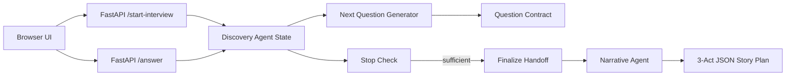
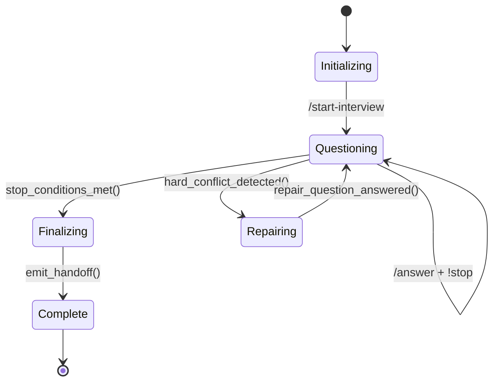
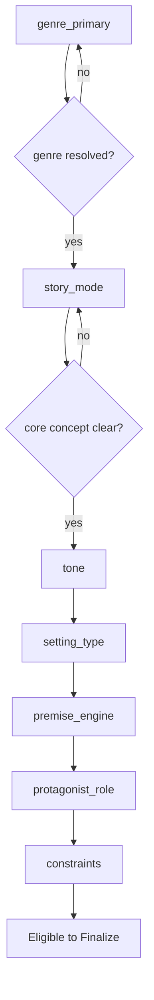

# Project KARLA: Discovery Layer Architecture Specification

**Version:** 1.0.0
**Status:** Approved for Implementation
**Author:** [Your Name] with Perplexity AI
**Created:** April 1, 2026
**Updated:** April 1, 2026
**Audience:** Future-me (primary), Game Programming Instructor (secondary)
**Contract:** Discovery Agent → `User choices → Schematized System Prompt` → Narrative Agent[^1]

## Overview

The Discovery Layer is the browser-based frontend (HTML/CSS/JS → localhost FastAPI) that guides users through adaptive multiple-choice interviews to produce a **schematized system prompt** for the KARLA Narrative Agent. It replaces static prompts with structured creative intent capture, enabling consistent, high-quality visual novel story seeds.

**Key Responsibilities:**

- Gather genre, tone, setting, premise, character frame, and constraints via 5-10 adaptive questions
- Maintain interview state and confidence scores per facet
- Stop when seed is "good enough" for Narrative Agent (not exhaustive)
- Emit dual-format handoff: executable natural language + structured metadata

**Example Output Target:**

```
"Write a story plan for a visual novel game about a group of old people who notice the staff of their nursing home behaving strangely and menacingly when a newly-discovered comet passes overhead."
```


## System Context




## Core Data Contracts

### 1. Story Spec (Structured Seed)

The canonical object representing discovered creative intent. **Narrative Agent treats this as authoritative control signals.**

```yaml
story_spec:
  core_concept:
    genre_primary: enum[horror|mystery|romance|fantasy|sci-fi|slice_of_life]  # REQUIRED
    genre_secondary: string|null
    tone: enum[eerie|melancholic|warm|bleak|playful|surreal|tense|tender]     # REQUIRED  
    novelty_bias: enum[classic|balanced|strange|experimental]
    premise_engine: string                                                    # REQUIRED
    story_mode: enum[investigation|survival|romance_building|social_intrigue] # REQUIRED
  setting_profile:
    setting_type: enum[nursing_home|small_town|academy|city|spaceship]        # REQUIRED
    setting_scale: enum[intimate|neighborhood|town|regional|enclosed]         # REQUIRED
    realism_mode: enum[realistic|supernatural|speculative|ambiguous]          # REQUIRED
    atmosphere_tags: string[]
  character_profile:
    protagonist_archetype: enum[outsider|investigator|elderly_leader|survivor]
    protagonist_role: string                                                  # REQUIRED
    cast_shape: enum[sparse|balanced|ensemble_heavy]
  # ... (full spec in §6)
```


### 2. Question Contract

Every question is a structured object for UI rendering + semantic processing.

```yaml
question:
  identity:
    question_id: uuid
    turn_index: int  # 1-based
  intent:
    facet_target: string  # e.g. "premise_engine"
    blocking: boolean
  presentation:
    prompt_text: string
    ui_variant: enum[single_select|multi_select]
    choices: choice[]
  policy:
    selection_mode: enum[single|multi]
    skippable: boolean
```

**Example:**

```yaml
prompt_text: "What should make this story start feeling wrong?"
choices:
  - label: "People start behaving strangely"
    semantic_effect:
      set: {premise_engine: "strange_behavior"}
      merge: {atmosphere_tags: ["watchful", "uneasy"]}
```


### 3. Final Handoff Payload (Discovery → Narrative)

**REQUIRED contract between layers:**

```yaml
discovery_handoff:
  version: "1.0"
  session_id: uuid                    # UUIDv4
  completion_grade: enum[sufficient|strong|underspecified]
  natural_language_prompt: string     # Narrative Agent consumes directly
  story_spec: story_spec              # Structured control signals
  creative_guidance: 
    open_degrees: string[]            # What Narrative can invent
    authorial_notes: string[]
  constraints:
    content_bounds: 
      gore: enum[none|low|moderate|high]
      violence: enum[none|low|moderate|high]
      sexuality: enum[none|low|moderate|high]
    must_include: string[]
    must_avoid: string[]
```


## Interview State Machine

### State Model




### Stop Conditions (Ordered Priority)

1. **Minimum Completeness** (Required facets resolved)
    - `genre_primary`, `tone`, `premise_engine`, `story_mode`
    - `setting_type`, `setting_scale`, `realism_mode`
    - `protagonist_role`, `constraints.content_bounds`
2. **Confidence Threshold**
    - Mean(required facets) ≥ 0.75
    - No required facet < 0.60
3. **Contradiction Free**
    - No unresolved `hard_conflict`
4. **Question Budget**
    - Soft: 5-8 questions
    - Hard cap: 12 questions
5. **Early Stop**
    - Last 2 answers added < 0.10 total confidence

## Question Generation Priority




## Semantic Update Model

Each choice produces a declarative `update_packet`:


| Operation | Effect | Example |
| :-- | :-- | :-- |
| `set` | Hard assignment | `genre_primary = horror` |
| `merge` | List append | `atmosphere_tags += ["claustrophobic"]` |
| `bias` | Soft preference | `realism_mode lean supernatural` |
| `clear` | Reset field | `genre_secondary = null` |

**Confidence deltas by operation:**

- Direct `set` on target facet: +0.30 to +0.40
- Cross-facet `merge`: +0.10 to +0.20
- `bias`: +0.05 to +0.10
- `surprise_me`: +0.00


## Backend API Contract

```yaml
POST /start-interview → {question: question_contract}
POST /answer?session_id=uuid 
  body: {choice_id: uuid}
  → {question: question_contract, current_state_summary: brief}
GET  /summary?session_id=uuid → {story_spec: partial, confidence: summary}
POST /finalize?session_id=uuid → {discovery_handoff: complete_payload}
```


## Facet Taxonomy (Complete)

| Tier | Facet | Required | Values |
| :-- | :-- | :-- | :-- |
| Core | `genre_primary` | Yes | horror, mystery, romance, fantasy, sci-fi, slice_of_life |
| Core | `tone` | Yes | eerie, melancholic, warm, bleak, playful, surreal, tense |
| Core | `premise_engine` | Yes | freeform string |
| Core | `story_mode` | Yes | investigation, survival, romance_building, social_intrigue |
| Setting | `setting_type` | Yes | nursing_home, small_town, academy, spaceship, estate |
| Setting | `setting_scale` | Yes | intimate, neighborhood, town, enclosed |
| Character | `protagonist_role` | Yes | nursing_home_resident, detective, student, engineer |
| Constraint | `content_bounds` | Yes | `{gore: low, sexuality: none}` |

## Implementation Notes

### UUID Usage

- All `session_id`, `question_id`, `choice_id` use UUIDv4
- Generate server-side on `/start-interview`
- Persist in FastAPI session store (Redis, in-memory dict for prototype)


### Frontend Expectations

- Single-page app consuming question contracts
- Render `prompt_text`, `choices[].label`, `helper_text`
- POST selected `choice_id` to `/answer`
- No local state beyond current question


### Confidence Model (0.0-1.0)

```
0.00 = unknown
0.25 = weak signal  
0.50 = working assumption
0.75 = generation-ready
0.95+ = user-confirmed stable
```


## Validation Checklist

**Before calling complete:**

- [ ] All required `story_spec` fields populated
- [ ] `natural_language_prompt` is 1-2 vivid sentences
- [ ] `constraints.content_bounds` defined (use safe defaults)
- [ ] Mean confidence(required facets) ≥ 0.75
- [ ] No `hard_conflict` unresolved
- [ ] `questions_asked` ≤ 12

**Narrative Agent guarantees:**

- Consume `natural_language_prompt` directly
- Honor all `constraints`
- Respect `story_spec` field values
- Invent only within `creative_guidance.open_degrees`


## Example Complete Flow

```
1. Q: "What kind of story?" → "Horror"
2. Q: "Horror flavor?" → "Cosmic unease" 
3. Q: "Where?" → "Nursing home"
4. Q: "Who leads?" → "Elderly resident"
5. Q: "Fear style?" → "Slow paranoia"
6. Q: "Limits?" → "Low gore, no sex"

→ STOP (required facets @ 0.82 avg confidence)
→ EMIT handoff matching your working sample
```


***

**This specification is IMPLEMENTATION-READY.** All contracts, boundaries, and validation rules are defined. Backend can build from API contract + state machine. Frontend needs only question rendering. Narrative Agent integration is dual-format for robustness.

**Future-me:** Start with FastAPI + in-memory state + question templates. Add LangGraph after core loop works.
**Instructor:** This demonstrates clean agent boundaries, structured state management, adaptive UI generation, and production-grade contract design within KARLA pipeline.[^1]
<span style="display:none">[^10][^11][^12][^13][^14][^15][^16][^17][^18][^19][^2][^20][^21][^3][^4][^5][^6][^7][^8][^9]</span>

<div align="center">⁂</div>

[^1]: KARLA_README.md

[^2]: https://github.com/centreon/centreon-collect/issues/797

[^3]: https://github.com/geany/geany

[^4]: https://github.com/MohGovIL/Ramzor/issues/14

[^5]: https://github.com/ray-project/ray/issues/34685

[^6]: https://github.com/praveenjuge/myna

[^7]: https://github.com/flutter/flutter/issues/96241

[^8]: https://cli.github.com/manual/gh_help_exit-codes

[^9]: https://github.com/AK478BB/ATM-Instruction/blob/main/【AK杂谈】新手只玩虚拟系统不碰真实系统的十大好处.txt

[^10]: https://github.com/pop-os/systemd/issues/5

[^11]: https://github.com/Koshak1013/HuananzhiX99_BIOS_mods/issues/90

[^12]: https://news.ycombinator.com/item?id=32563000

[^13]: http://fiercefun.com/gamesdevelopment/GuideLines HTML/Guidelines for the Functional Specification.htm

[^14]: https://pyrodactyl.com/2015/11/25/good-robot-38-specing-a-feature/

[^15]: https://www.cs.cornell.edu/courses/cs5152/2024sp/assignments/a5/

[^16]: https://making.close.com/posts/writing-technical-specification-for-feature-development/

[^17]: https://www.cs.cornell.edu/courses/cs5152/2025sp/assignments/a5/

[^18]: https://onix-systems.com/blog/how-to-write-project-specifications

[^19]: https://playbooks.com/skills/ian-pascoe/dotfiles/writing-spec

[^20]: https://www.techquity.co.nz/ncea-resources/requirements-and-specifications

[^21]: https://www.youtube.com/watch?v=tZ2qWIkrLYw

